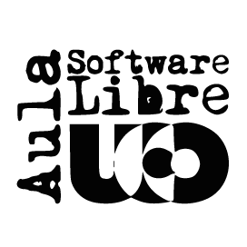

# Taller de docker

    

Este taller forma parte de las actividades del [Aula de Software Libre de la
Universidad de Córdoba](https://www.uco.es/aulasoftwarelibre).

!!! info
    Se recomienda acudir al evento con tu propio portátil y con una distribución _GNU/Linux_ compatible con _Docker_: _Ubuntu_, _Debian_, _Fedora_ o _CentOS_. Si no dispones de ordenador propio notifícalo a los organización en la web de la actividad.

!!! warning
    Para evitar demoras innecesarias en el inicio de la actividad es necesario traer ya de casa _Docker_ instalado. Para ello lee el capítulo de [Instalación](./installation).
